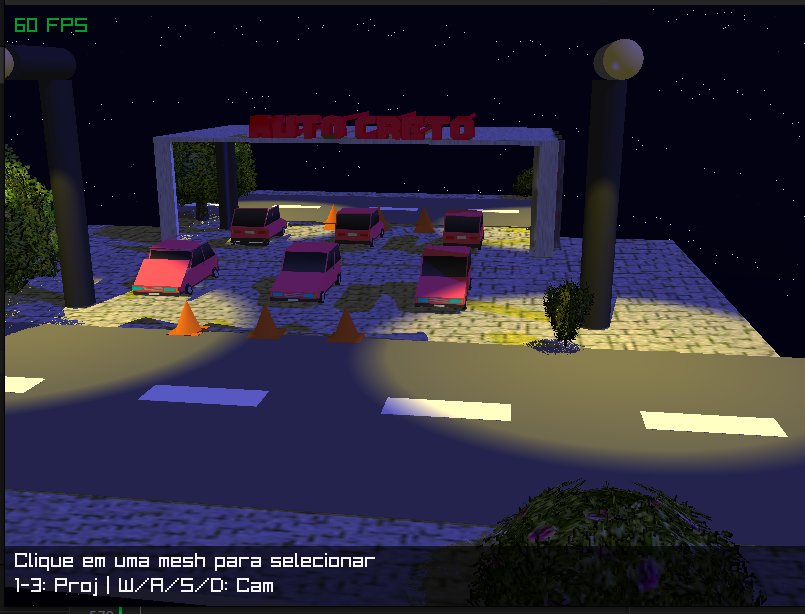

# 🖥️ Raycasting & Raytracing Engine - CG1


> **Disciplina:** Computação Gráfica 1  
> **Universidade:** Universidade Federal do Ceará (UFC)  
> **Professor:** Creto Augusto Vidal  
> **Semestre:** 2025.2 

---

## 📸 Screenshot




## 📖 Sobre o Projeto

Este projeto consiste na implementação de um motor de renderização baseado em **Raycasting** (com elementos de Raytracing recursivo), desenvolvido em C++ moderno. O objetivo foi criar uma cena 3D complexa "do zero", implementando toda a matemática de interseção, iluminação e texturização manualmente, utilizando a **Raylib** apenas para gerenciamento de janela e input.

A cena apresentada simula um ambiente urbano com iluminação noturna, reflexos e vegetação.

## ✨ Funcionalidades Implementadas

### 🚀 Core & Geometria
* **Raycasting Puro:** Geração de raios primários a partir da câmera.
* **Primitivas Matemáticas:** Esferas, Cilindros, Cones e Planos (infinitos e finitos).
* **Malhas de Triângulos:** Carregamento de arquivos `.obj` (ex: carros, postes, lojas).
* **Acelerador de Interseção:** Bounding Volume Hierarchy (BVH/AABB) para otimizar o render de malhas complexas.

### 💡 Iluminação e Materiais
* **Modelo de Iluminação:** Blinn-Phong (Ambiente, Difusa e Especular).
* **Tipos de Luz:**
    * *Directional Light* (Luz do luar/ambiente).
    * *Spotlight* (Postes de iluminação com *cutoff* angular).
* **Sombras:** Raycasting secundário para verificação de oclusão (Hard Shadows).

### 🎨 Texturas e Detalhes
* **Mapeamento de Textura:** Suporte a arquivos PNG/JPG (via `stb_image`).
* **Filtro Bilinear:** Suavização de texturas para evitar pixelização em aproximações.
* **Alpha Cutout:** Suporte a texturas com transparência (usado nas árvores/folhagens).
* **Tiling:** Repetição automática de texturas em planos infinitos (chão).

### 🪞 Raytracing Recursivo
* **Reflexão Especular:** Implementação de espelhos planos perfeitos ou foscos através de chamadas recursivas de raio (`cast_ray`).

### 🎥 Câmera e Interação
* **Projeções:** Alternância em tempo real entre Perspectiva, Ortográfica e Oblíqua.
* **Free Camera:** Movimentação da câmera pelo cenário (WASD).
* **Object Picking:** Seleção de objetos na cena com o mouse e movimentação com as setas.

---

## 🎮 Controles

| Tecla / Ação | Função |
| :--- | :--- |
| **W, A, S, D** | Movimentar a Câmera (Frente, Esquerda, Trás, Direita) |
| **1** | Projeção Perspectiva |
| **2** | Projeção Ortográfica |
| **3** | Projeção Oblíqua |
| **Clique Esquerdo** | Selecionar Objeto (Picking) |
| **Setas (⬆️⬇️⬅️➡️)** | Mover o objeto selecionado |

---

## 🛠️ Como Compilar e Rodar

### Pré-requisitos
* Compilador C++ (GCC, Clang ou MSVC)
* CMake (versão 3.10 ou superior)
* Biblioteca **Raylib** instalada no sistema.

### Passo a Passo (Linux/Mac)

```bash
# 1. Clone o repositório
git clone git@github.com:khiuta/raycasting-cg-1.git
cd raycasting-cg-1

# 2. Crie a pasta de build
mkdir build
cd build

# 3. Gere os arquivos de make e compile
cmake ..
make

# 4. Execute o projeto
./main